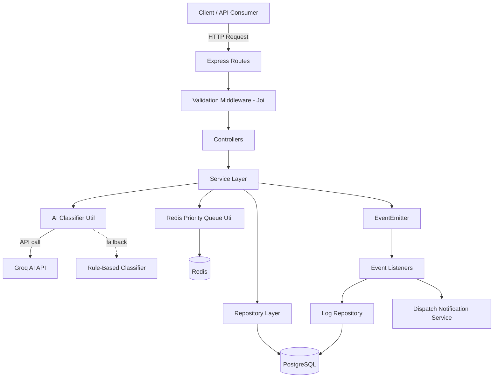

# ResQ — System Design Document
### AI-Assisted Emergency Request and Dispatch Management System

---

## 1. Overview

ResQ is a backend system for logging emergency requests, classifying their urgency using an AI model (with a rule-based fallback), queueing them by priority, and dispatching the nearest available responder. It follows an MVC + Service Layer + Repository Pattern architecture with an event-driven core for real-time-style notifications.

---

## 2. Architecture

**Layers:**
- **Routes** — define REST endpoints, attach Joi validation middleware
- **Controllers** — parse requests, call services, shape HTTP responses
- **Services** — business logic: classification, priority calculation, nearest-responder matching, event emission
- **Repositories** — all raw SQL/database access, isolated from business logic
- **Utils** — AI classifier (Groq + rule-based fallback), Redis queue operations, logger, custom error class
- **Events** — a Node `EventEmitter` used for decoupled, event-driven side effects (logging, dispatch notification)

---

## 3. Database Schema (PostgreSQL)

Inferred from the repository layer and live API responses.

### `emergency_requests`
| Column | Type | Notes |
|---|---|---|
| id | serial PK | |
| user_id | integer | requester |
| latitude | decimal | |
| longitude | decimal | |
| description | text | raw emergency description |
| category | varchar | Medical / Fire / Police |
| priority | varchar | low / medium / high / critical |
| recommended_responder | varchar | Paramedic / Firefighter / Police Officer |
| classification_source | varchar | `ai` or `rule_engine` |
| status | varchar | pending / assigned / in_progress / resolved / cancelled |
| created_at | timestamp | |
| updated_at | timestamp | |

### `responders`
| Column | Type | Notes |
|---|---|---|
| id | serial PK | |
| name | varchar | |
| type | varchar | Paramedic / Firefighter / Police Officer |
| phone | varchar | |
| status | varchar | available / busy |
| latitude | decimal | used for nearest-responder matching |
| longitude | decimal | |
| created_at | timestamp | |

### `assignments`
| Column | Type | Notes |
|---|---|---|
| id | serial PK | |
| request_id | FK → emergency_requests.id | |
| responder_id | FK → responders.id | |
| assigned_at | timestamp | |
| notes | text (nullable) | |

### `status_history`
| Column | Type | Notes |
|---|---|---|
| id | serial PK | |
| request_id | FK → emergency_requests.id | |
| old_status | varchar | |
| new_status | varchar | |
| changed_by | integer (nullable) | |
| changed_at | timestamp | |

### `logs`
| Column | Type | Notes |
|---|---|---|
| id | serial PK | |
| event | varchar | e.g. `emergency:created`, `dispatch:notified` |
| payload | jsonb | event-specific data |
| created_at | timestamp | |

---

## 4. Redis Usage

Redis is used as a **priority queue** for pending emergency requests, separate from the persistent PostgreSQL record.

- **On creation** — a newly created emergency is `enqueue`d into Redis, scored by priority (so `critical`/`high` requests surface first).
- **On fetch (`GET /emergencies/pending`)** — `getPendingIds()` reads the ordered ID list back from Redis; the service layer then hydrates full records from PostgreSQL and re-sorts them to match Redis's priority order.
- **On resolution/cancellation/assignment** — the request is `dequeue`d from Redis, since it no longer needs to appear in the pending queue.

This keeps the "what needs attention right now, in what order" concern fast and separate from the durable system-of-record in PostgreSQL.

---

## 5. Event-Driven Flow

A central Node.js `EventEmitter` decouples side effects from the main request/response cycle.

| Event | Emitted when | Consumed by |
|---|---|---|
| `emergency:created` | A new emergency is logged | Log repository |
| `responder:assigned` | A responder (manual or auto) is assigned | Log repository |
| `status:updated` | Emergency status changes | Log repository |
| `emergency:resolved` | Reserved for resolution-specific side effects | — |
| `dispatch:notified` | A dispatch notification is triggered | Log repository, (simulated) responder notification |

**Example flow — creating and dispatching an emergency:**
1. `POST /emergencies` → AI/rule classification → insert into PostgreSQL → enqueue in Redis → emit `emergency:created` → log persisted
2. `POST /responders/auto-assign` → nearest available matching responder found → assignment created → responder marked busy → emergency marked `assigned` → dequeued from Redis → emit `responder:assigned` → log persisted
3. `POST /dispatch/notify` → emits `dispatch:notified` with emergency + location payload → log persisted
4. `PATCH /emergencies/:id/status` → status updated → entry added to `status_history` → emit `status:updated` → log persisted
5. `GET /emergencies/:id/timeline` → reads the full `status_history` trail built up by step 4, in order

---

## 6. New Features Added

1. **AI confidence score + reasoning** — both the Groq classifier and the rule-based fallback now return a `confidence` (0–1) and a human-readable `reasoning` string alongside the existing classification fields.
2. **Estimated response time** — a priority-to-minutes lookup calculated at creation time and attached to the response, with no schema change.
3. **Automatic nearest-responder assignment** — a new `POST /responders/auto-assign` endpoint that finds the closest available responder (Haversine distance) matching the required type, then reuses the existing assignment logic — the original manual `/responders/assign` endpoint is untouched.
4. **Emergency timeline endpoint** — a new read-only `GET /emergencies/:id/timeline` endpoint exposing the existing `status_history` table as an ordered timeline.

All four features are strictly additive: no existing field, endpoint, or table column was renamed or removed, preserving backward compatibility with the original API contract.
